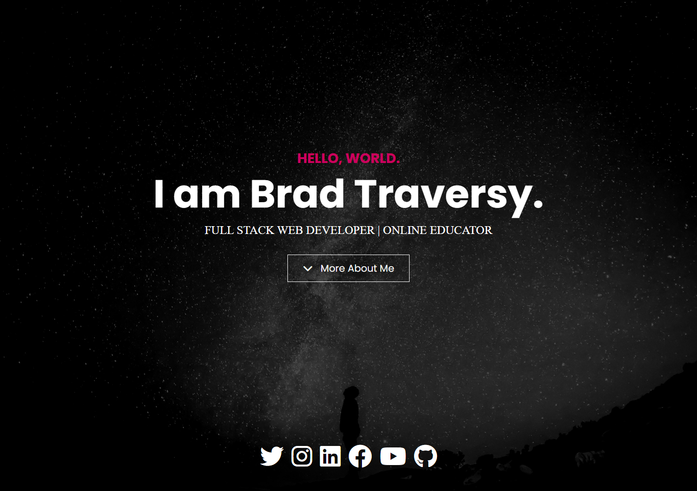

# Portfolio Website



# Kullanım

Bu web sitesi [Bootstrap](https://getbootstrap.com/) ve [Sass](https://sass-lang.com/) ile oluşturulmuştur.

Bu web sitesini özelleştirebilmek için [Node.js](https://nodejs.org/en/) yüklemeniz gerekmektedir. Ardından, bu depo'yu klonlayın ve şu komutu çalıştırın:

```bash
npm install
```

Bu, Bootstrap, Sass ve Font Awesome'ı yükleyecektir.

Sass'tan CSS dosyalarınızı oluşturmak için şu komutu çalıştırın:

```bash
npm run sass:build
```

Sass dosyalarınızı değişiklikler için izlemek üzere şu komutu çalıştırın:

```bash
npm run sass:watch
```
